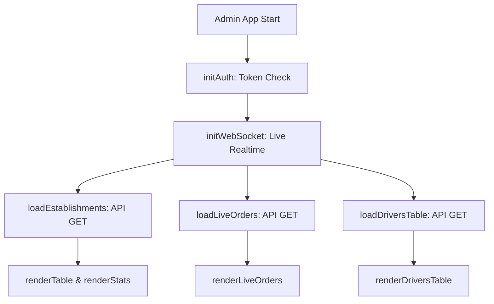
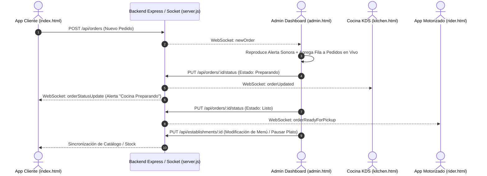

# MANUAL TÉCNICO DE ARQUITECTURA Y REFERENCIA DE INGENIERÍA: PANEL DE ADMINISTRACIÓN (ADMIN) - PEDI GOCHOS

> **Documento Técnico de Referencia Permanente**  
> **Fecha de Elaboración:** Septiembre 2026  
> **Sistema:** PediGochos Central Admin Dashboard (`public/admin.html`, `public/js/admin.js`, `public/css/admin.css`)  
> **Propósito:** Registrar de forma exhaustiva la funcionalidad de cada botón, interacción, impacto reactivo en las demás aplicaciones (Cliente, Repartidor, Cocina, Servicios), flujo de WebSockets, almacenamiento y protocolos de recuperación en caso de avería de código.

---

## 1. Arquitectura General del Panel de Administración

### 1.1 Archivos del Módulo
| Archivo | Rol Técnico |
|---|---|
| `public/admin.html` | Estructura DOM de vistas, modales, formularios y tablas. |
| `public/js/admin.js` | Objeto maestro `AdminApp` con estado en memoria, lógica de negocio y llamadas API. |
| `public/css/admin.css` | Reglas de estilo oscuro, capas de profundidad (`z-index`), animación y responsive. |
| `server.js` | Backend Express, endpoints REST (`/api/...`) y servidor WebSocket para tiempo real. |

### 1.2 Inicialización y Flujo de Arranque (`AdminApp.init()`)
Al cargar `admin.html`, el ciclo de arranque ejecuta:
1. `initAuth()`: Verifica el token de sesión en `sessionStorage` / `localStorage` (`admin_token`). Si no existe o expira, muestra el modal de autenticación (`#admin-login-modal`).
2. `initWebSocket()`: Conecta con el servidor en `/` mediante `WebSocket`. Escucha eventos: `newOrder`, `orderStatusUpdate`, `serviceQuote`, `driverStatusChange`, `paintQuoteMsg`.
3. `loadEstablishments()`: Consulta `GET /api/establishments` y almacena los datos en `this.establishments`.
4. `loadLiveOrders()`: Consulta `GET /api/orders` y almacena los pedidos en `this.orders`.
5. `loadDriversTable()`: Consulta `GET /api/drivers` y llena la flota de motorizados.
6. `renderStats()`: Calcula los KPIs en tiempo real (Ingresos Totales, Pedidos Hoy, Comercios Activos, Conductores Online).
7. `renderTable()`: Dibuja la tabla central de comercios y servicios activos.
8. `renderLiveOrders()`: Dibuja la tabla de pedidos y auxilios viales en vivo.



---

## 2. Sección: Restaurantes, Comercios y Servicios Activos (`#admin-table-body`)

Controla el directorio maestro de establecimientos y los 6 servicios especializados.

### Tabla de Botones e Interacciones
| Elemento / Botón | Función en `admin.js` | Descripción y Parámetros | Impacto Reactivo en Otras Apps |
|---|---|---|---|
| **Filtro de Categorías** (`.btn-category-pill`) | `AdminApp.filterCategory(cat)` | Filtra la tabla por `all`, `comidas`, `farmacias`, `mercados`, `ferreterias`, `servicios`. | Solo afecta la vista local del Admin. |
| **Buscador de Comercio** (`#admin-search-input`) | `AdminApp.handleStoreSearch(query)` | Búsqueda insensible a mayúsculas por nombre de local o clave de enlace. | Local en Admin. |
| **Botón 🗺️ Ver Mapa** | `AdminApp.openStoreMap(estId)` | Abre Google Maps con las coordenadas `latitude, longitude` del local. | Ninguno externo. |
| **Botón 📦 Modificar Inventario / Menú** | `AdminApp.openMenuEditorForShop(shopId)` | Asigna `window.activeShopIdForMenu = shopId`, abre `#menu-tables-modal` en la pestaña `menu`, y renderiza el catálogo con `loadModalProducts()`. | Permite alterar la carta que ve el cliente de inmediato. |
| **Botón ⚙️ Modificar Info** | `AdminApp.openEditShopModalFor(shopId)` | Abre `#edit-est-modal` cargando nombre, categoría, delivery fee, horarios, logo y banner. | Al guardar (`PUT /api/establishments/:id`), el cliente ve los nuevos banners y horarios de forma inmediata. |
| **Botón 🔑 Clave (✏️)** | `AdminApp.promptChangeLinkKey(shopId, name, currentKey)` | Modal prompt para modificar la clave secreta de vinculación (`linkKey`) con la cocina KDS o app de comercio. | Si se cambia, la pantalla de cocina (`kitchen.html`) debe ingresar la nueva clave para sincronizarse. |
| **Botón 🟢 Habilitado / 🚫 Deshabilitado** | `AdminApp.toggleDisableEstablishment(shopId)` | Invierte `est.disabled` y ejecuta `PUT /api/establishments/:id`. | Si se deshabilita, en la app del cliente el restaurante aparece con overlay "Temporalmente Inactivo" y se bloquean los pedidos. |
| **Botón 🍳 KDS** | `AdminApp.openStoreKitchen(shopId)` | Abre en una nueva pestaña `kitchen.html?key=${est.linkKey}`. | Abre la pantalla de comandas de cocina en vivo. |
| **Botón 📱 QR** | `AdminApp.openStoreQRModal(shopId)` | Abre `#admin-store-qr-modal` con generación de QR de mesa o de local directo. | Permite imprimir material POP para mesas. |
| **Botón 🗑️ Eliminar Comercio** | `AdminApp.deleteEstablishment(shopId, name)` | Confirmación de seguridad y `DELETE /api/establishments/:id`. | Remueve el restaurante de la app del cliente de forma permanente. |

---

## 3. Taller de Menú, Inventario y Distribución (`#menu-tables-modal`)

Modal principal de gestión de inventario y carta del restaurante activo (`window.activeShopIdForMenu`).

### 3.1 Pestaña `menu`: Catálogo Comercial de Productos
El inventario funciona como un **catálogo interactivo completo**:
- **Cuadrícula (`#modal-products-catalog-grid`)**: Renderiza tarjetas de catálogo con fotografía superior en aspect-ratio 16:10, tag de stock flotante (`🟢 En Stock` / `🚫 Agotado`), nombre del plato en fuente 14.5px negrita, precio verde COP, categoría y badge de modificadores.
- **Acción al presionar la tarjeta**: Tocar cualquier parte de la tarjeta ejecuta `AdminApp.openProductSpecsModal(prod.id)`.
- **Botón `⏸️ Pausar / ▶️ Habilitar`**: Ejecuta `AdminApp.toggleProductStatus(prod.id)` invirtiendo `prod.available` y `prod.is_paused`. Guarda por `PUT /api/establishments/:id` y en la app del cliente el plato se marca como "Agotado por hoy".
- **Botón `✏️ Editar`**: Abre la ficha técnica de producto (`#product-specs-modal`).
- **Botón `🗑️`**: Ejecuta `AdminApp.deleteProductFromModal(prod.id)` eliminando el plato de `est.products` con confirmación.

### 3.2 Ficha de Especificaciones del Producto (`#product-specs-modal`)
| Campo / Botón | Selector / Evento | Lógica y Persistencia | Impacto en App Cliente |
|---|---|---|---|
| **Nombre del Plato** | `#specs-product-name` | Texto editable obligatorio. | Actualiza el título del producto en el catálogo. |
| **Categoría** | `#specs-product-category` | Categoría asignada (ej. Hamburguesas, Pizzas). | Asigna el producto a la subcategoría interna. |
| **Precio Base** | `#specs-product-price` | Valor numérico en COP. | Modifica el precio base en el catálogo y carrito. |
| **Descripción** | `#specs-product-description` | Ingredientes y descripción comercial. | Texto desplegado al tocar el producto en el cliente. |
| **Disponibilidad en Cocina** | `#specs-status-active-btn` / `#specs-status-paused-btn` | `AdminApp.setSpecsModalStockStatus(isAvailable)`. | Si se pausa, el cliente ve el badge "🚫 Agotado" y el botón de compra se inhabilita. |
| **Días Disponibles** | `#specs-available-days-pills` | Selector de días (`todos`, `lunes`, `martes`...). | Si el día actual no coincide, el cliente ve "Solo disponible los [días]". |
| **Foto del Producto** | `#specs-product-image-file` | Sube la imagen a CDN / carpeta local o usa URL existente. | Actualiza la foto visual en alta definición del cliente. |
| **Ingredientes / Exclusiones** | `#specs-ingredients-list` | Permite agregar ingredientes con precio extra para exclusiones o sustituciones. | En el cliente, el modal de personalización permite desmarcar ingredientes no deseados ("Sin cebolla", etc.). |
| **Grupos de Opciones y Adicionales** | `#specs-groups-container` | Grupos tipo radio (selección única obligatoria) o checkbox (múltiples adicionales/toppings con precio extra). | Genera las opciones desplegables dentro del cliente antes de añadir al carrito. |
| **Botón 🗑️ Eliminar Producto** | `AdminApp.deleteProductFromSpecsModal()` | Elimina el producto de la carta, guarda en servidor y cierra el modal. | Desaparece de la app del cliente al instante. |
| **Botón 💾 Guardar Especificaciones** | `AdminApp.handleSpecsSubmit(event)` | Valida campos, serializa ingredientes y opciones, envía `PUT /api/establishments/:id` y refresca el catálogo. | Sincronización instantánea de carta y KDS. |

### 3.3 Otras Pestañas del Taller de Menú
- **Pestaña `daily` (Especiales del Día)**: Filtra platos por día de la semana para configurar promociones diarias.
- **Pestaña `ai` (Escanear Menú con IA)**: Sube una foto o PDF de una carta física; el motor IA extrae automáticamente nombres, precios, categorías y descripciones.
- **Pestaña `tables` (Mesas y Códigos QR)**: Genera códigos QR individuales por mesa (`tableNumber`). Al escanearlo, el cliente abre la app con el parámetro `?store=ID&mesa=NUM` para pedir a la mesa sin camarero.
- **Pestaña `catalog` (Catálogo Maestro)**: Permite importar platos globales estándar con foto y descripción con 1 solo toque.

---

## 4. Control de Pedidos y Auxilios Viales en Vivo (`#admin-live-orders-tbody`)

Monitoreo central en tiempo real de todos los pedidos gastronómicos, carreras de mototaxi/auto y auxilios de cauchera.

### 4.1 Filtros Superiores de Pedidos
- **Todos (`all`)**: Muestra todas las órdenes cronológicamente.
- **Restaurantes (`restaurant`)**: Filtra órdenes de comidas, supermercados y farmacias.
- **Vehículos (`ride`)**: Filtra solicitudes de Moto Taxi, Auto Express y Auto de Lujo.
- **Cauchera (`cauchera`)**: Filtra solicitudes de auxilio vial 24/7 (despinches, carga de batería, cambio de caucho).

### 4.2 Interacciones por Fila de Pedido
| Botón / Control | Función en `admin.js` | Flujo Técnico | Impacto Reactivo |
|---|---|---|---|
| **Selector de Estado** (`<select>`) | `AdminApp.updateOrderStatusFromSelect(orderId, newStatus)` | Actualiza el estado (`Pendiente`, `Preparando`, `Listo`, `En Camino`, `Entregado`, `Cancelado`). Envía `PUT /api/orders/:id/status`. Emite WebSocket `orderStatusUpdate`. | La app del cliente reproduce alerta sonora y actualiza la barra de progreso en vivo. Si pasa a "Listo", la app de repartidores notifica que el pedido puede ser recogido. |
| **Botón 💬 Cliente (WhatsApp)** | Enlace `https://wa.me/...` | Abre WhatsApp Web / App con plantilla pre-redactada incluyendo número de orden, nombre del cliente y detalles del servicio. | Canal directo de soporte con el comprador. |
| **Botón 🛞 El Cachu** | Enlace `https://wa.me/584245516340` | Abre chat con el técnico de guardia de la Cauchera Móvil 24/7 enviando datos del vehículo y coordenadas GPS. | Despacho inmediato del mecánico motorizado. |
| **Botón 🍳 Cocina** | `AdminApp.openStoreKitchen(estId)` | Abre el KDS del restaurante correspondiente. | Inspección de comanda en cocina. |
| **Botón 👁️ Detalles / Recibo** | `AdminApp.openReceiptViewerModal(order)` | Abre `#admin-receipt-viewer-modal` con foto del comprobante de transferencia (Pago Móvil / Zelle / Bancolombia). | Validación manual de pagos bancarios. |

---

## 5. Módulo de Servicios Especializados

Control técnico de los 6 servicios integrados en la plataforma:

### 1. 🎨 Latonería y Pintura Automotriz (`#admin-paint-modal`)
- **Apertura**: `AdminApp.openPaintAdminModal()`.
- **Inspección de Cotizaciones**: `AdminApp.openQuoteChatInspector(quoteId, 'paint')`. Abre `#admin-quote-chat-modal` con chat bidireccional en vivo con el cliente, previsualización de fotos de daños del vehículo y emisión de presupuestos formales.
- **Impacto Cliente**: El cliente ve la respuesta del taller en su modal de presupuesto y puede aceptar la cotización.

### 2. 🖨️ 3D Lab - Impresión y Prototipado (`#admin-print3d-modal`)
- **Apertura**: `AdminApp.openPrint3DAdminModal()`.
- **Cotizador STL**: Permite evaluar gramos de filamento PLA/PETG o resina fotosensible, horas de impresión y emitir cotización al cliente.

### 3. ✨ ShelliArt - Resina y Recuerdos (`#admin-resin-modal`)
- **Apertura**: `AdminApp.openResinAdminModal()`.
- **Fichas Técnicas**: Inspecciona personalización de llaveros de letras, pan de oro, borlas, glitter y recuerdos de eventos.

### 4. 🪅 Piñatas Personalizadas & Catálogo (`#admin-pinatas-modal`)
- **Apertura**: `AdminApp.openPinatasAdminModal()`.
- **Pestaña Pedidos**: Fichas técnicas de piñatas a medida con motivo, edad y dimensiones.
- **Pestaña Inventario & Catálogo**: Muestra el catálogo de piñatas en stock (`renderPinatasInventory`). Permite crear nuevos modelos (`saveNewPinataProduct`) o eliminar piñatas existentes (`deletePinataProduct`).

### 5. 🛞 Cauchera Móvil 24/7 (`#admin-cauchera-modal`)
- **Apertura**: `AdminApp.openCaucheraAdminModal()`.
- **Configuración de Tarifas**: Guarda número WhatsApp de guardia, tarifa base Moto COP, tarifa base Auto COP y recargo nocturno mediante `saveCaucheraSettings()`.
- **Feed de Auxilios Viales**: Renderizado en vivo de auxilios con botón a mapa Google Maps y enlace directo a WhatsApp.

### 6. 🛵 Mototaxi & Auto Express (`#admin-register-driver-modal`, `#admin-driver-chat-modal`)
- **Filtro de Carreras**: `AdminApp.setOrdersFilter('ride')`.
- **Registro de Flota**: Registra nuevos motorizados con teléfono, modelo de moto/carro, placa y foto.
- **Chat de Flota**: `AdminApp.openDriverChatModal()` para emisión de avisos y despacho centralizado.

---

## 6. Sincronización en Tiempo Real y WebSockets



---

## 7. Protocolo de Contingencia y Resolución de Averías (Troubleshooting)

### Problema A: Los modales de servicios no abren al hacer clic en los botones
- **Causa Raíz Común**: La regla CSS `.modal-overlay:not(.active)` en `admin.css` bloquea la visibilidad con `!important` si falta la clase `.active`.
- **Solución Técnica**: Asegurar que la función en `admin.js` ejecute:
  ```javascript
  modal.classList.add('active');
  this.checkModalOpenState();
  ```
  Y verificar que en `admin.css` el selector tenga excepciones:
  ```css
  .modal-overlay:not(.active):not(.open):not([style*="display: flex"]):not([style*="display: block"]) {
      display: none !important;
  }
  ```

### Problema B: Un producto modificado en el Admin no se actualiza en el Cliente
- **Causa Raíz**: El objeto `products` en memoria en el cliente está usando caché de `localStorage` o no se recargó la API.
- **Solución Técnica**:
  1. Verificar que el `PUT /api/establishments/:id` devuelva `HTTP 200`.
  2. En `marketplace.js`, llamar a `MarketplaceApp.loadEstablishments()` o presionar F5.

### Problema C: Las órdenes no emiten sonido o no entran en tiempo real
- **Causa Raíz**: Bloqueo de reproducción automática de audio del navegador (Autoplay Policy) o socket desconectado.
- **Solución Técnica**:
  1. El usuario debe haber interactuado (clic) con la página admin para desbloquear el `AudioContext`.
  2. Verificar en la consola si el socket está en `readyState === 1` (`WebSocket.OPEN`).

### Problema D: Procedimiento para Recompilar Distribución y APK Android
Si se hacen cambios en archivos de `public/`, ejecutar siempre en PowerShell:
```powershell
node scripts/build-admin-app.js; node scripts/build-client-app.js
$env:JAVA_HOME = "C:\Program Files\Android\Android Studio\jbr"; node scripts/build-client-apk.js
```
El archivo de producción se genera en la raíz como `PediGochos-Principal.apk`.
